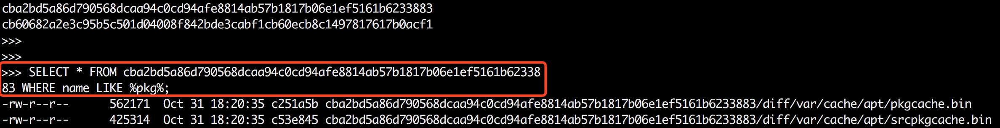

# SQL-Image

SQL-Image is a daemon-less docker image analyzer.

SQL-Image treat docker-images as DATABASES and image-layers as TABLES.

Inspired by https://github.com/wagoodman/dive and https://github.com/kashav/fsql.

## Syntax
~~~~sql
SHOW IMAGES;

USE my-image:v1;

SHOW LAYERS;

SELECT … FROM my-layer WHERE ...;
~~~~

## Note 
Only support linux overlay2 docker environment.